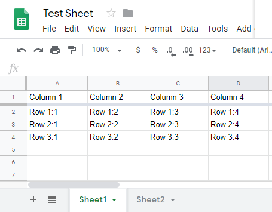
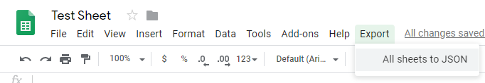
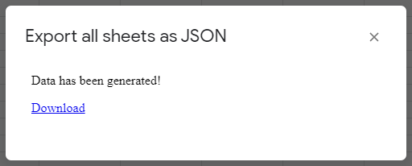

# spreadsheet-to-json
Easilly export your google spreadsheet to a JSON file using this extension.

## Features
- Simple data to JSON conversion
- Converts all of your tab pages
- Direct download JSON file
- Extending the menu bar

## Example

### Input Sheet


### Output JSON
````json
{
  "Sheet1": [
    {
      "Column 1": "Row 1:1",
      "Column 2": "Row 1:2",
      "Column 3": "Row 1:3",
      "Column 4": "Row 1:4"
    },
    {
      "Column 1": "Row 2:1",
      "Column 2": "Row 2:2",
      "Column 3": "Row 2:3",
      "Column 4": "Row 2:4"
    },
    {
      "Column 1": "Row 3:1",
      "Column 2": "Row 3:2",
      "Column 3": "Row 3:3",
      "Column 4": "Row 3:4"
    }
  ],
  "Sheet2": [
    {
      "Column 1": "Row 1:1",
      "Column 2": "Row 1:2",
      "Column 3": "Row 1:3",
      "Column 4": "Row 1:4"
    },
    {
      "Column 1": "Row 2:1",
      "Column 2": "Row 2:2",
      "Column 3": "Row 2:3",
      "Column 4": "Row 2:4"
    },
    {
      "Column 1": "Row 3:1",
      "Column 2": "Row 3:2",
      "Column 3": "Row 3:3",
      "Column 4": "Row 3:4"
    }
  ]
}
````

## Usage
1. Click **Export->All sheets to JSON** from the menu bar inside of your spreadsheet.


2. Wait untill the download button is visible in the dialog.


3. Download the file by clicking on the *Download* link.

## Installation
1. Open script editor
2. Import sources from repository
3. Reload your spreadsheet

### Open script editor
Open your google spreadsheet and open the script editor from the menu bar **Tools->Script Editor**.

### Import sources from repository
Clone/download this repository and navigate to the **src** directory. You must now import all the source files one-by-one *(afaik)*. To add a source file, click the **File->New->Script file** button in the menu bar of the script editor and copy the content of the file you want to import into the editor. For the html file your must use the **File->New->HTML file** button.

### Reload your spreadsheet
Don't forget to save (*ctrl+s*) the files you've added into the script editor. Now you can close the script editor and reload your spreadsheet to add the menu.

## Notes
- Duplicate column names will overwrite each other
- Tabs with the same name will overwrite each other

## TODO
- Warn for duplicate columns
- Warn for duplicate tabs
- Export single sheet
- Import JSON feature
- Register as drive addon
